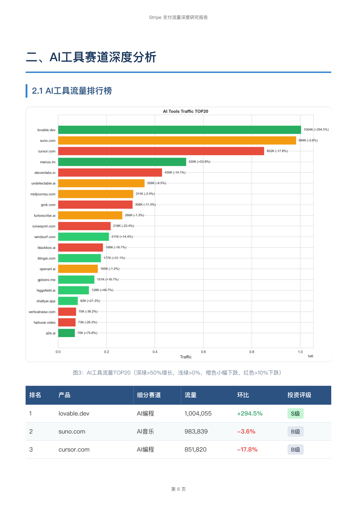
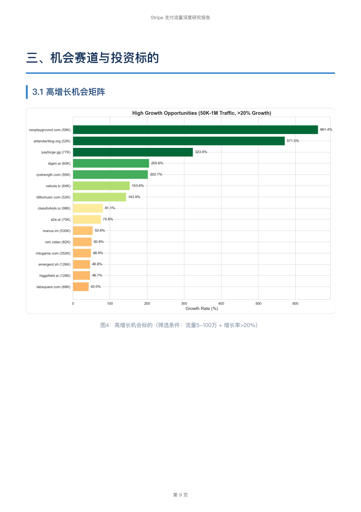
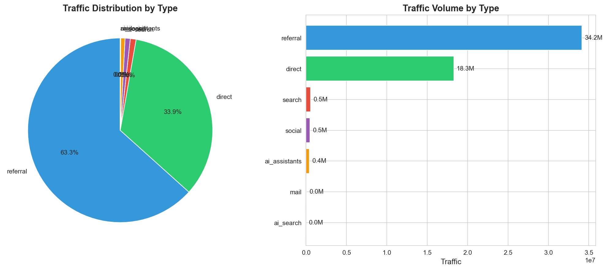
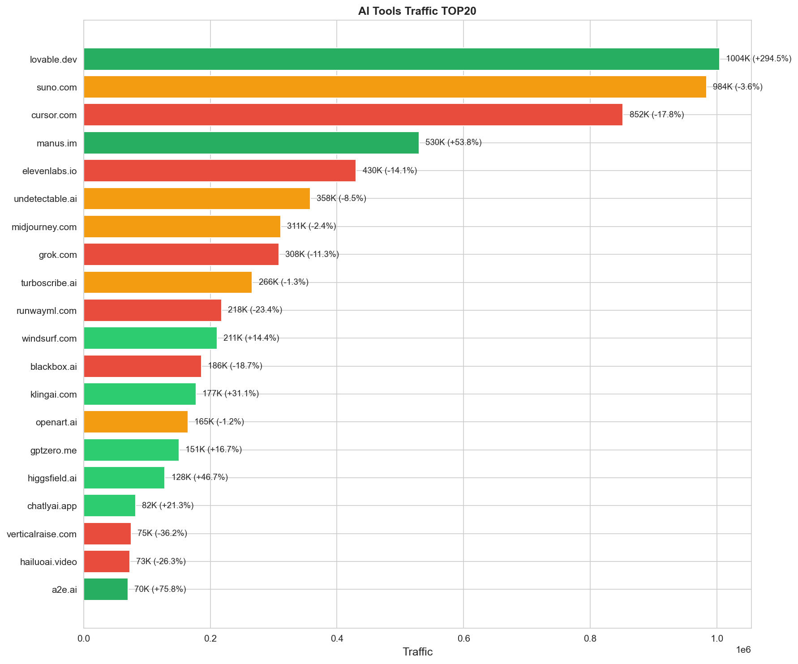
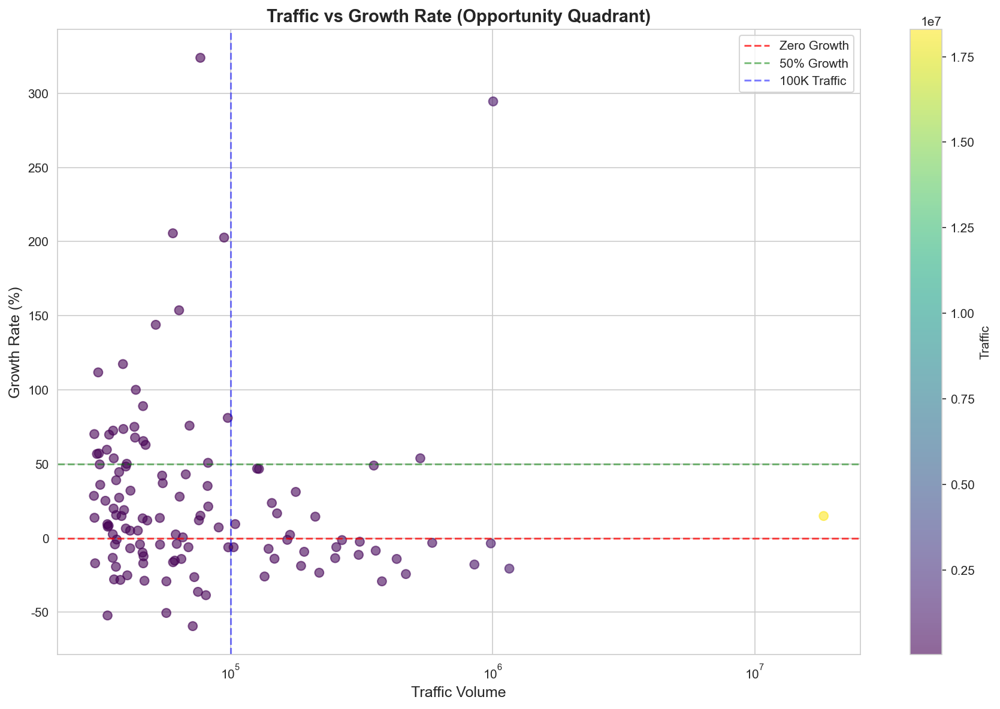

# Zhiyun Skills

志云的 Claude Skills 集合，持续更新中

## traffic-analyzer

网站流量分析和市场洞察工具，帮你从 SEMrush/SimilarWeb 数据中发现商业机会。

### 效果预览

#### 生成的研究报告

| | |
|:---:|:---:|
|  |  |
| 专业研报封面 | 核心指标摘要 |

| | |
|:---:|:---:|
|  |  |
| AI工具赛道深度分析 | 高增长机会矩阵 |

#### 数据可视化图表

| | |
|:---:|:---:|
|  |  |
| 流量类型分布 | AI 工具流量对比 |



### 安装

#### 快速安装（推荐）

```bash
npx skills add jueyunai/zhiyun-skills
```

#### 注册插件市场

在 Claude Code 中运行：

```bash
/plugin marketplace add jueyunai/zhiyun-skills
```

#### 安装技能

**方式一：直接安装**

```bash
/plugin install traffic-analyzer@zhiyun-skills
```

**方式二：告诉 Agent**

直接告诉 Claude Code：

> 请帮我安装 github.com/jueyunai/zhiyun-skills 中的 Skills

### 使用

#### 1. 准备数据

准备一个包含流量数据的 CSV 文件，需要以下列：

| 列名 | 说明 | 示例 |
|------|------|------|
| `type` | 流量类型 | direct, referral, search, social, ai_assistants |
| `target` | 来源域名 | cursor.com, suno.com, lovable.dev |
| `traffic` | 当前流量 | 1020181 |
| `prev_traffic` | 上期流量 | 983839 |
| `traffic_diff` | 增长率 | 0.53（增长 53%），-0.17（下降 17%） |
| `traffic_share` | 流量占比 | 0.018（表示 1.8%） |

#### 2. 告诉 Claude

直接用自然语言告诉 Claude：

```
帮我分析这个流量数据 data.csv
```

```
找出高增长的 AI 编程工具，生成研究报告
```

```
对比 Cursor、Windsurf、Lovable 的流量表现
```

### 核心功能

- **增长分析** - 识别高增长流量来源
- **AI 工具发现** - 发现 AI/ML 产品机会
- **竞争分析** - 对比产品流量表现
- **报告生成** - 生成专业 PDF 研究报告

---

## 目录结构

```
zhiyun-skills/
├── README.md
├── LICENSE
├── screenshots/
└── traffic-analyzer/
    ├── SKILL.md          # Claude 读取的技能文档
    ├── scripts/          # Python 脚本
    ├── templates/        # 报告模板
    └── references/       # 参考文档
```

## License

MIT
